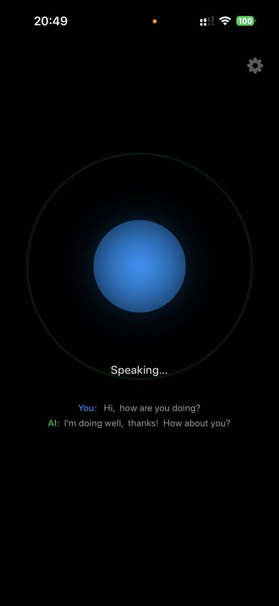

# ClawVoice

<p align="center">
  
</p>

<p align="center">
  <strong>Your OpenClaw server. Your voice. No screen required.</strong>
</p>

<p align="center">
  
  &nbsp;&nbsp;&nbsp;
  
</p>

---

## What makes it different

Most voice assistants use basic TTS and push-to-talk buttons.

ClawVoice uses **Gemini Live API** — a real-time bidirectional audio stream. You talk naturally, Gemini listens, understands, and responds with native voice synthesis. You can interrupt it mid-sentence. It hears you even with the screen off. All the heavy lifting — memory, tools, web search, messaging — runs on your own **OpenClaw** server with whichever AI model you've configured.

| Other apps | ClawVoice |
|---|---|
| Push-to-talk button | Always listening |
| Basic TTS (robotic) | Gemini Live native voice |
| Cloud-only brain | Your OpenClaw server |
| Screen must be on | Works with screen off |

---

## Key features

- 🎙 **Always listening** — tap once to start, speak naturally
- 🔒 **Screen off** — lock your phone and keep talking; audio session stays alive
- 🎧 **Any headphones** — AirPods, wired, Bluetooth; speaker mode as fallback  
- ⚡ **Gemini 2.5 Flash** — the fastest native audio model available (`gemini-2.5-flash-native-audio-preview-12-2025`)
- 🤖 **OpenClaw backend** — your AI model executes actions: web search, messages, reminders, smart home, anything your server can do (supports any provider OpenClaw supports)
- 🍎 **Hey Siri activation** — say *"Hey Siri, [your phrase]"* to launch and start listening immediately
- 🔋 **Battery friendly** — minimal UI, no video, no camera, no polling
- 🔐 **Private** — your keys, your server, no third-party cloud routing

---

## How it works

```
You speak
    │  PCM audio · 16 kHz
    ▼
Gemini Live API (Google)
    │  understands intent → calls execute(task)
    ▼
ClawVoice app
    │  POST /v1/chat/completions
    ▼
OpenClaw server  (your machine, via Tailscale)
    │  your AI model runs tools — search, messages, calendar, skills...
    ▼
result text → Gemini synthesizes natural voice response
    │  PCM audio · 24 kHz
    ▼
Your headphones or speaker
```

**Session context:** each voice session maps to exactly one OpenClaw server session. The context accumulates naturally as you talk. Pause or close the app → next session starts fresh with a clean context.

---

## Requirements

**You need all three before setup:**

### 1 · OpenClaw server

An [OpenClaw](https://openclaw.ai) gateway running on your machine with `/v1/chat/completions` enabled:

```json5
// ~/.openclaw/openclaw.json
{
  "gateway": {
    "port": 18789,
    "http": {
      "endpoints": {
        "chatCompletions": { "enabled": true }
      }
    },
    "auth": {
      "mode": "token",
      "token": "your-gateway-token"
    }
  }
}
```

```bash
openclaw gateway restart
```

### 2 · Tailscale

Tailscale connects your iPhone to your home server over an encrypted VPN — no port forwarding, works anywhere, free tier is enough.

**Install on your server**, then get the machine's Tailscale URL from [login.tailscale.com](https://login.tailscale.com) — it looks like `https://your-machine.tail06d585.ts.net`.

**Install on your iPhone** from the App Store and log in to the same account.

> **Same Wi-Fi?** You can skip Tailscale and use your server's local IP: `http://192.168.1.x:18789`.

### 3 · Gemini API key

Get a free key at [aistudio.google.com/apikey](https://aistudio.google.com/apikey). The Live API is included in the free tier.

---

## Setup

```bash
git clone https://github.com/lucasudar/clawvoice-ios.git
open clawvoice-ios/ClawVoice.xcodeproj
```

1. **Signing** → Xcode → ClawVoice target → Signing & Capabilities → set your Team and a unique Bundle ID
2. **Keys** → tap ⚙️ in the app after launch, enter your Gemini key, OpenClaw URL and token
3. **Run** → Cmd+R → allow microphone when prompted

A free Apple ID is enough to run on your own device — no paid developer account needed.

---

## Siri Shortcut

iOS doesn't allow fully custom always-on wake words, but Siri Shortcuts let you pick **any phrase** as a trigger:

1. **Shortcuts app** → **+** → Add Action → search *ClawVoice* → **Activate Assistant**
2. Tap the shortcut name → **Add to Siri** → record any phrase you like (e.g. your assistant's name, a nickname, anything you want)
3. Say **"Hey Siri, [your phrase]"** — app launches and immediately starts active listening

No button tap needed. Works with screen off and any headphones paired with your phone.

---

## Permissions

| Permission | Why |
|---|---|
| **Microphone** | To hear your voice |
| **Background audio** | To keep listening when the screen is off |

---

## Troubleshooting

**"Connection Error" on first tap** — check your Gemini API key in Settings ⚙️

**OpenClaw not responding** — confirm Tailscale is connected on both devices; verify `chatCompletions.enabled: true` in your gateway config

**Gemini error 1008** — try a different model in Settings; Google occasionally renames Live API models. Try `gemini-2.0-flash-live-001` as fallback

**Echo / assistant hears itself** — happens when using phone speaker without headphones; the 500ms mute window after each response suppresses most echo. Use headphones for best results

**Choppy audio on Bluetooth** — prefer AirPods or wired headphones; generic BT headsets sometimes add codec latency

---

## Tech stack

- **SwiftUI** · iOS 17+
- **URLSessionWebSocketTask** · no SPM dependencies
- **AVAudioEngine** · PCM 16 kHz capture, 24 kHz Float32 playback
- **Gemini Live API** · `v1beta` WebSocket · `gemini-2.5-flash-native-audio-preview-12-2025`
- **OpenClaw** `/v1/chat/completions` · one server session per voice session (new session on pause or app close)

---

## License

MIT
