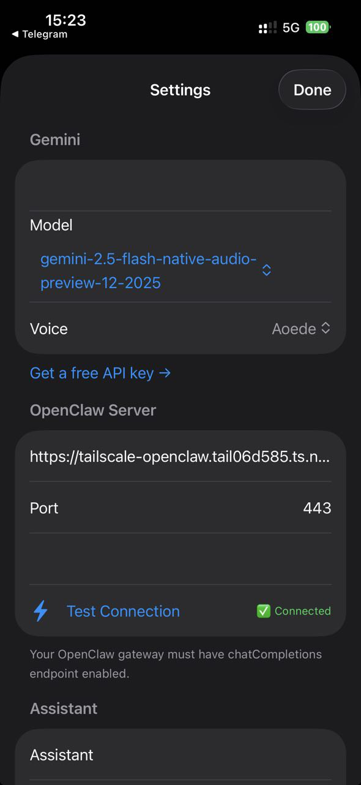

# ClawVoice

> ⚠️ **Work in progress** — actively developed. Core voice loop works; some rough edges remain.

A minimal iOS voice assistant for [OpenClaw](https://github.com/openclaw/openclaw) server owners.

**Tap to talk** (or trigger via Siri Shortcut) → **Gemini Live** handles real-time voice I/O → **OpenClaw** executes actions with Claude → response spoken back through your phone or headphones.

No video. No camera. No continuous streaming. Just voice.

**Works with screen off** — audio session stays active when the display sleeps, so you can lock your phone and keep talking hands-free.

<p align="center">
  
  &nbsp;&nbsp;&nbsp;
  
</p>

---

## How it's different

Most OpenClaw voice clients use push-to-talk + basic TTS. ClawVoice uses **Gemini Live API** — a real-time bidirectional audio WebSocket — so the conversation feels natural: Gemini listens, thinks, speaks, and can be interrupted mid-sentence. OpenClaw handles all the actual intelligence and tool execution (Claude, your skills, your data).

---

## Prerequisites

You need **all three** of the following before setting up the app:

### 1. OpenClaw server

OpenClaw must be running and reachable from your iPhone. Follow the [official setup guide](https://docs.openclaw.ai).

The gateway config (`~/.openclaw/openclaw.json`) must have the `/v1/chat/completions` endpoint enabled:

```json
{
  "gateway": {
    "port": 18789,
    "http": {
      "endpoints": {
        "chatCompletions": { "enabled": true }
      }
    },
    "auth": {
      "mode": "token",
      "token": "your-gateway-token-here"
    }
  }
}
```

After editing, restart the gateway:
```bash
openclaw gateway restart
```

### 2. Tailscale (recommended for remote access)

Tailscale lets your iPhone reach your home server securely over HTTPS from anywhere — no port forwarding needed.

**On your server (Docker Compose example):**

```yaml
services:
  tailscale:
    image: tailscale/tailscale:latest
    container_name: tailscale
    network_mode: host
    cap_add:
      - NET_ADMIN
      - SYS_PTRACE
    environment:
      - TS_AUTHKEY=tskey-auth-YOUR_KEY_HERE
      - TS_STATE_DIR=/var/lib/tailscale
      - TS_SERVE_CONFIG=/config/serve-config.json
    volumes:
      - /DATA/AppData/tailscale:/var/lib/tailscale
      - /DATA/AppData/tailscale/serve-config.json:/config/serve-config.json
    restart: unless-stopped
```

**`serve-config.json`** (proxies HTTPS → OpenClaw):
```json
{
  "TCP": { "443": { "HTTPS": true } },
  "Web": {
    "${TS_CERT_DOMAIN}:443": {
      "Handlers": { "/": { "Proxy": "http://localhost:18789" } }
    }
  }
}
```

After Tailscale is up, your server is accessible at `https://your-machine.tail06d585.ts.net`. Enable HTTPS in the [Tailscale admin console](https://login.tailscale.com/admin/dns).

> **Without Tailscale:** you can use a local IP (`http://192.168.1.x:18789`) if your iPhone and server are on the same Wi-Fi.

### 3. Gemini API key

Get a free key at [aistudio.google.com/apikey](https://aistudio.google.com/apikey).

The app uses the **Gemini Live API** (`gemini-2.5-flash-native-audio-preview-12-2025` model) — a real-time audio WebSocket. This is different from the standard Gemini text API; make sure your key has Live API access (free tier works).

---

## App Setup

### 1. Clone & open

```bash
git clone https://github.com/lucasudar/clawvoice-ios.git
open clawvoice-ios/ClawVoice.xcodeproj
```

That's it — the `.xcodeproj` is included, no manual project setup needed.

### 2. Set your Bundle ID & Team

In Xcode:
1. Click the **ClawVoice** project in the left sidebar
2. Select the **ClawVoice** target → **Signing & Capabilities**
3. Set **Team** to your Apple Developer account
4. Change **Bundle Identifier** to something unique (e.g. `com.yourname.ClawVoice`)

> You need a free Apple Developer account to run on a real device. Free accounts can sideload apps — no paid membership required.

### 3. Configure keys

Open **`ClawVoice/Secrets.swift`** and fill in your values:

```swift
struct Secrets {
    static let geminiApiKey  = "AIza..."           // Gemini API key
    static let openClawHost  = "https://your-machine.tail06d585.ts.net"  // or http://192.168.1.x
    static let openClawPort  = 443                 // 443 for Tailscale HTTPS, 18789 for local HTTP
    static let openClawToken = "your-gateway-token"
}
```

Or leave `Secrets.swift` empty and configure everything inside the app via **Settings ⚙️** after launch.

### 4. What is Info.plist?

`Info.plist` is an iOS configuration file that declares app permissions and capabilities. The one in this repo is already configured correctly — **you don't need to edit it**. It contains:

- `NSMicrophoneUsageDescription` — the text iOS shows when asking for microphone permission. Required for any app that uses the mic.
- `UIBackgroundModes: [audio]` — allows the app to keep audio running when the screen is off. Without this, the mic would stop as soon as you lock the phone.

If Xcode shows a "signing" error related to entitlements, just make sure your Bundle ID is unique (step 2 above).

### 5. Build & run

Select your iPhone as the target → **Cmd+R**.

On first launch, iOS will ask for microphone permission — tap **Allow**.

---

## Using the app

| Action | Result |
|--------|--------|
| Tap orb | Start / pause listening |
| Tap while listening | Pause (mic off, connection stays alive) |
| Tap while paused | Resume listening |
| Double-tap (future) | End session |

**Orb colors:**
- ⚪ White — idle, tap to start
- 🔵 Blue pulsing — listening
- ⚫ Gray still — paused
- 🟡 Amber — working (calling OpenClaw)
- 🟢 Green breathing — Gemini speaking

---

## Siri Shortcut (hands-free activation)

iOS doesn't allow custom always-on wake words, but you can use a Siri Shortcut to trigger the app with a custom phrase:

1. Open **Shortcuts** app → tap **+**
2. Add Action → search **ClawVoice** → select **Activate Assistant**
3. Tap the shortcut name → rename it (e.g. *Mr Krabs*)
4. Tap **Add to Siri** → record your phrase
5. Say **"Hey Siri, Mr Krabs"** — app opens and starts listening immediately

Works with screen off, AirPods, Apple Watch.

---

## Architecture

```
iPhone mic
    │ PCM 16kHz (100ms chunks)
    ▼
Gemini Live API  ←──────────────────────────────────┐
    │ tool call: execute(task: "...")                │
    ▼                                               │
ClawVoice app                                       │
    │ POST /v1/chat/completions                      │
    ▼                                               │
OpenClaw Gateway (your server)                      │
    │ Claude processes task, runs skills             │
    ▼                                               │
  result text ────────────────────────────────────>─┘
                                    Gemini speaks the result
                                    (PCM 24kHz → speaker)
```

---

## Server: Docker Compose reference

Minimal compose setup with OpenClaw + Tailscale:

```yaml
services:
  openclaw:
    image: ghcr.io/openclaw/openclaw:latest
    container_name: openclaw-gateway
    ports:
      - "18789:18789"
    volumes:
      - /DATA/AppData/openclaw:/home/node/.openclaw
    environment:
      - ANTHROPIC_API_KEY=sk-ant-...
    restart: unless-stopped

  tailscale:
    image: tailscale/tailscale:latest
    container_name: tailscale
    network_mode: host
    cap_add: [NET_ADMIN, SYS_PTRACE]
    environment:
      - TS_AUTHKEY=tskey-auth-...
      - TS_STATE_DIR=/var/lib/tailscale
      - TS_SERVE_CONFIG=/config/serve-config.json
    volumes:
      - /DATA/AppData/tailscale:/var/lib/tailscale
      - /DATA/AppData/tailscale/serve-config.json:/config/serve-config.json
    restart: unless-stopped
```

---

## File structure

```
ClawVoice/
├── ClawVoiceApp.swift          # App entry point
├── ContentView.swift           # Main UI — animated orb + status
├── SettingsView.swift          # In-app configuration
├── AppSettings.swift           # UserDefaults persistence
├── AssistantSession.swift      # Central coordinator
├── Secrets.swift               # API keys (fill in before building)
├── Audio/
│   └── AudioManager.swift      # Mic capture (16kHz) + playback (24kHz Float32)
├── Gemini/
│   ├── GeminiLiveService.swift # WebSocket client for Gemini Live API
│   ├── GeminiConfig.swift      # Model + voice config
│   └── GeminiModels.swift      # JSON encode/decode types
├── OpenClaw/
│   ├── OpenClawBridge.swift    # HTTP client → /v1/chat/completions
│   └── ToolCallRouter.swift    # Routes Gemini tool calls to OpenClaw
└── Intents/
    └── AssistantIntent.swift   # Siri Shortcut integration
```

---

## Troubleshooting

**"Connection Error" on first tap**
→ Check your Gemini API key in Settings ⚙️. Make sure it has Live API access.

**OpenClaw not reachable**
→ Test the connection in Settings → "Test Connection". Make sure Tailscale is running on both your phone and server. Check that `chatCompletions.enabled: true` in `openclaw.json`.

**Choppy audio**
→ Try wired headphones or AirPods. Bluetooth audio latency can cause gaps.

**Gemini model error (1008 policy violation)**
→ In Settings, try a different model from the dropdown. Google frequently renames Live API models. Recommended: `gemini-2.5-flash-native-audio-preview-12-2025`. Fallback: `gemini-2.0-flash-live-001`.

**App stops when screen locks**
→ Make sure `UIBackgroundModes: audio` is in Info.plist (it is by default in this repo). Check that microphone permission is granted in iOS Settings → Privacy → Microphone.

---

## License

MIT
